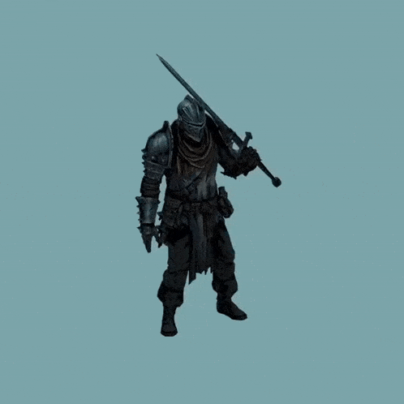

# Hello, Im Lautaro Rivieri

### About me... 🤔

I am a first-year Full-Stack Programming student at the Provincial University of Córdoba (UPC). I am passionate about programming and convinced that every step, no matter how small, brings me closer to my goals.

### What I'm learning 📚

- **Python (basic level):** Programming logic, control structures, and list and dictionary management.
- **SQL (basic level):** Database fundamentals, including DML and DDL commands, subqueries, and normalization.

### Languages ⚙

<!-- Languages ​​that I no longer use for the moment

-->

### Tools 🛠

### Personal projects 💼

- **ETL with SSIS + SQL Server:**
  I implemented a complete extraction, transformation, and loading (ETL) process for various data sources, including Excel, XML, and CSV files, a currency API, and a downloadable database. The project was developed in Visual Studio with Microsoft SQL Server tools as part of a free course.

  For ethical reasons, I am not sharing the original project, as it worked with a business database with over 650,000 records. I'm currently planning to replicate the process with public databases like Northwind or AdventureWorks, with the goal of consolidating knowledge and publishing it on GitHub and LinkedIn.

- **Working in it...**

### How I enjoy the process 👏

> "Do not be afraid of being slow, only fear stopping." -Chinese proverb-

This proverb reminds me that perseverance and curiosity are my best allies. I dedicate one hour a day to practicing, reviewing official documentation, and solving small challenges to improve my logic and experience.

### What I'm looking for 🎯

**Mentors and peers:** I want to connect with professionals and students to exchange ideas, questions, and experiences.

**Practical projects:** I will collaborate on projects that allow me to apply what I'm learning and receive constructive feedback.

**Personal and professional growth:** My goal is to strengthen my technical foundations and develop teamwork skills.

I'm convinced that, with dedication and good company, I can become a capable programmer. Are you up for this journey of learning and discovery? 👏

### Contact with me... 📩

### Next steps 📌

- Publish the replicated ETL process with Northwind on GitHub
- Deepen your knowledge of Python and SQL with personal project

**Thank you for taking the time to read this... I hope you like me! 😉**

### [**back ⬆**](#hello-im-lautaro-rivieri)
